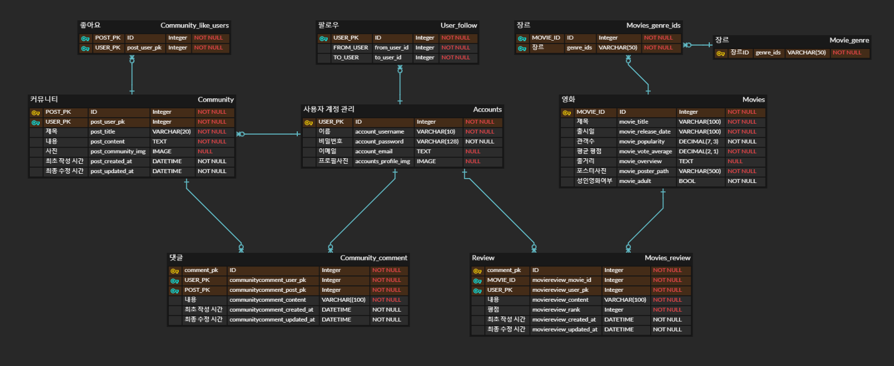
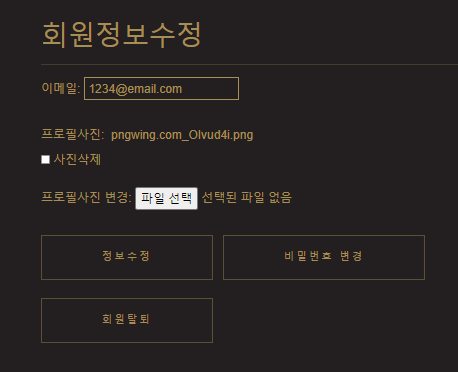

# PJT Final

## 🔔 목표

➕ 영화 정보 기반 추천 서비스 구성

➕ 커뮤니티 서비스 구성

➕ HTML, CSS, JS, DB 등을 활용한 실제 서비스 설계


## ✍ 팀원 정보 및 업무 분담 내역

📄 `FE : 박지유 (JS)`    `BE : 장세영 (Django)`

📄 `소통 수단 : Notion`

📄 `ERD : erdcloud`

📄 `DB Seeding`  영화 정보를 엑셀로 받은 뒤에 Json 파일로 변환 후 PJT에 적용 예정


## 🎛 데이터베이스 모델링 (ERD)




## 🧾 목표 서비스 구현 및 실제 구현 정도

### A. 목표 서비스 구현

- 관리자 권한의 유저만 영화 등록 / 수정 / 삭제 / 유저 관리 권한을 가짐
- Database Seeding을 활용하여 최소 50개 이상 데이터 구성
- 영화에 대한 평점 등록 / 수정 /삭제 기능 구성
- 등록한 평점에 대한 점보를 기반으로 영화 추천기능 구성 + 이외의 방법으로 1개 이상 추천기능 구성
- 영화 관련 대화를 나눌 수 있는 커뮤니티 기능 구현

### B. 실제 구현 정도

- 위의 목표 서비스를 모두 구현
- tmdb api를 활용해 영화 목록 불러오기(개봉 예정, 현재 상영 중 목록 등)
- 좋아요, 팔로우 기능 구현
- pagination으로 다량의 영화 목록 관리
- Carousel을 통해 해당 조건에 맞는 영화의 포스터 이미지 페이지 상단에 표출
- 검색기능을 통해 입력한 문자열이 포함된 영화 제목 출력

- Face_recognization을 통한 나이 계산으로 연령대 별 영화 추천, 그리고 평점, 인기, 장르별로 추천시스템 추가


## 🎞 필수 기능에 대한 설명

### A. admin

❔ 관리자 권한의 유저만 영화 정보를 변경할 수 있도록 관리자 페이지 생성


✔ 기능 구현에 힘을 더 쏟기로 하고 해당 사항은 기본 admin 페이지로 관리하도록 했다.


### B. 영화 목록

❔ 로그인 된 유저가 영화에 대한 평점 등록 / 수정 / 삭제 등을 할 수 있어야 함

💯 Database Seeding을 활용해 최소 50개 이상의 데이터가 존재하도록 구성하기


✔ 전체 영화 목록에서 상단의 이미지 또는 하단의 영화 제목을 클릭했을 때 해당 영화의 상세정보로 들어갈 수 있도록 구현했다.

✔ Pagination을 통해 영화 정보가 10개가 넘어가면 다음 페이지에서 볼 수 있도록 설정했다.


✔ 상세 페이지에서 영화의 상세정보를 출력해주고 해당 영화에 대한 평점 및 댓글을 남길 수 있도록 설정했다.

✔ 댓글 기능을 구현하기 위해 전체 영화 목록 내의 영화들만 api를 통해 json파일로 저장하고 db에 넣어줬다. 일반적으로 api를 통해 불러오면 한 페이지 분량인 20개의 영화 리스트만 나오기 때문에 받아오는 페이지 수를 늘려 60개의 데이터를 받아올 수 있도록 설정했다.

✔ 전체 목록을 제외한 나머지 영화 목록은 DB에서 불러오는 것이 아니라 tmdb api를 통해 온라인으로 연결되도록 구현하였다.


✔ 검색창에 영화제목을 검색하면 그와 관련된 영화들의 포스터이미지, 제목, 줄거리가 나타나도록 구현했다.

### C. 영화 추천

❔ 사용자에게 영화를 추천하는 페이지 구성 

💯 사용자가 등록한 평점을 기반으로 한 영화 추천 알고리즘 구성

- 높은 평점 순, 인기 영화


✔  tmdb에서 받아온 정보를 평점에 따라 내림차순으로 정렬하여 순위를 매기고, 인기 영화는 tmdb에서 받아온 리스트를 순차적으로 출력했다.

- Face_recognization으로 연령대 맞춤 영화 추천


✔ 네이버의 CLOVA Face Recognization으로 프로필 사진을 분석해 예상 나이와 성별을 출력하고, 연령대에 따라 출시일 기준으로 영화를 분류해 추천해줬다.

- 랜덤 영화 추천


✔ 장르를 선택하면 해당 장르가 포함된 무작위 영화를 최대 4개까지 추천해주도록 출력했다. 

✔ 해당 장르의 영화 개수가 4개 미만인 경우에는 장르 버튼을 누를 때 해당 영화들만 반복해서 출력되도록 구성했다.


### D. 프로필 정보

❔ 사용자 정보 출력하기

💯 jsonresponse, form 등을 이용해 사용자의 활동 내역, 팔로우 기능이 구현된 프로필 페이지 구성

- 프로필 링크


✔ 네이게이션 바 우측에 프로필 사진이 출력되고, 사진을 누르면 프로필 페이지로 가는 링크와 로그아웃이 가능한 탭이 구현돼있다.

- 프로필 페이지


✔ 해당 사용자의 작성 글, 댓글, 좋아요를 확인할 수 있고, 아래 평점을 남긴 영화를 누르면 해당 영화의 디테일 페이지로 가게 설정해주었다.

- 팔로우 유저 확인


✔ 모달을 통해 현재 사용자를 팔로우하거나 사용자가 팔로우한 사람의 명단을 확인할 수 있다.

- 사용자 정보 변경




✔ 사용자 이름 우측의 회원정보 수정 버튼을 눌러 사용자 정보를 변경하거나 회원탈퇴를 할 수 있다.

- 로그인


✔ 로그인을 할 수 있는 페이지와 navbar의 로그인 버튼을 통해 모달을 사용하여 로그인 할 수 있다.

- 회원가입


✔ 아이디, 비밀번호, 비밀번호 확인을 입력하여 회원가입을 할 수 있다.(이메일은 선택사항이다, 프로필 사진은 회원정보 수정을 통해 추가할 수 있도록 구성했다.)

### E. 커뮤니티

❔ 사용자끼리 대화가 가능한 커뮤니티 만들기

💯 django 템플릿과 JS를 활용해 CRUD기능이 구현된 커뮤니티 구성

- 게시글 리스트


✔ 페이지를 넘길 때 게시글의 위치가 변동되어 보기에 불편한 점을 고려해 각 페이지의 게시글 위치를 고정했다.

- 게시글 상세 정보


✔ 게시글과 댓글 모두 생성, 수정, 삭제가 가능하고, 사용자들이 해당 게시글의 좋아요 버튼을 누를 수 있도록 구성했다.


## 🛰 배포 서버 URL

- http://13.58.50.193/


## ❕ 프로젝트를 진행하면서 느낀 점

❕ 

❕ 

### 박지유

❕ 캐러셀을 동작하기 위해서 CDN을 사용했는데, 개인적으로 작성한 CSS와 충돌이 많이 일어나 문제를 해결하기 위해 시간을 많이 소비했습니다.

❕ CSS를 외부 참조, 내부 참조, 그리고 인라인으로 다양하게 사용해봤는데 코드를 작성할 때는 인라인으로 작성하는게 편했지만, 나중에 수정을 할 때는 외부 참조	와 내부 참조가 훨씬 편했고, 여러 html에 적용할 때는 외부 참조를 사용하는게 제일 좋다고 느꼈습니다.

❕ 홈페이지를 꾸미기 위해 인터넷에 있는 코드를 참고하면서 몰랐던 html 요소들의 구성, 그리고 상세 요소까지 적용할 수 있는 css들이 있다는 것을 알게됐습니다	(예: action, focus 등).

❕ JS는 배운기간과 연습기관이 짧아서 그런지 아직도 사용하면서 문법이나 구성방식에 혼란이 오는 것 같아 연습이 많이 필요하다고 생각했습니다.

❕ 기본 기능 구현을 생각보다 빠르게 끝내 시간이 널널하다고 생각했는데, 추가적으로 tmdb api를 사용하고 이것저것 추가하면서 시간이 많이 부족해졌습니다. 하	지만 api를 사용하며 다양한 동작을 추가할 수 있어서 재미있었습니다.

❕ 약 9일간 코드를 작성하고 오류를 수정하는 과정을 진행하면서 정말 많이 배운 것 같고 조금 힘든 감이 있었지만 결과물을 보니 속이 후련하고 뿌듯했습니다. 하	지만 2학기 때 더 어렵고 긴 기간의 프로젝트를 3개 해야한다는 점과 이것을 vue로 해야한다는 점이 막막하고 준비를 단단히 해야할 것 같습니다.

## 📜 타임라인

#### 1117

##### FE

- 디자인 상황

1. http://127.0.0.1:8000/movies/


1. http://127.0.0.1:8000/community/


1. http://127.0.0.1:8000/community/create/


- 배경색, 버튼, 네이게이션바 등 기본 틀을 구성
- 영화 DB를 받아온 후 캐러셀(Carousel)로 구성할 예정
- 커뮤니티와 게시글 제작 배치 변경 필요


##### BE

- Apps

  ````markdown
  # accounts	계정 인증 및 Follow / Like
  - templates
  signup / login / profile
  
  - forms
  CustomUserCreationForm 사용
  
  - models
  follow 기능에 ManyToManyField 사용 예정
  
  - urls / views
  signup / login / logout / profile / follow
  ````

  ```markdown
  # community	커뮤니티 서비스 제공용 App
  - templates
  index / form / detail (CRUD)
  
  - models
  Post 클래스 생성 ( 커뮤니티 글 게시용도 )
  
  - urls / views
  `community_`index / create / detail / update / delete
  ```

  ```markdown
  # movies	영화 정보 표시
  - templates
  index / detail / detail_review
  
  - models
  Movie, Comment 클래스 생성( 영화 정보와 그에 대한 평점 작성용 )
  
  - urls / views
  movie_index / movie_detail
  ```

  - 각 코드마다 주석 추가 필요
  - NoReverseMatchError 주의!

- 이전의 작업들에 익숙해져서 아무 생각없이 Vue연동에 필요한 코드를 작성해서 시간 순삭.... 시간 날리지 않게 좀 더 생각해보고 코드를 짤 필요가 있음.

- DB 시드는 영화진흥위원회에서 받아오려 했는데 엑셀 파일에 포스터 이미지 경로가 없어서 다른 방법이 있을 지 탐색 중

- 기본 뼈대만 만들어 놓은 뒤에 ERD 재작성 예정


#### 1118

##### FE

- 디자인 상황

1. http://127.0.0.1:8000/movies/


1. http://127.0.0.1:8000/community/


1. http://127.0.0.1:8000/community/pk/


- Navbar에 있던 계정 관련 기능을 Dropdown으로 구현
- Modal 기능을 활용해 Login기능을 구현(Navbar를 통해서 사용)
- 배치를 좀 더 다듬었음
- 내일 DB를 추가한 후 캐러셀 구상해야함
- 커뮤니티 내용과 영화리스트에 Pagination을 구현해야함
- 회원가입, 계정정보 수정 폼을 수정해야함


##### BE

- Apps

  ````markdown
  # accounts
  - templates
  change 추가
  
  - forms
  CustomUserChangeForm 추가
  
  - urls / views
  change / delete 추가
  ````

  ```markdown
  # community
  - models
  created_at, updated_at 추가
  
  - urls / views
  `community_`comment_create, comment_delete 추가
  ```

- 댓글을 수정할 수 있는 기능을 만들고 싶었는데... 하루를 다 투자해도 해결이 안됨. 추후에 더 고민해봐야 할 과제로..

- 회원정보수정 기능을 만들었는데, 코드 어딘가를 잘못 수정했는지 다시 또 동작을 안함. 다시 찾아볼 예정

- 회원탈퇴를 별도의 인증없이 가능하게 구현했고, 기본적인 기능들을 전부 완료하면 인증도 추가해보고 싶긴 하다.


### 1119

##### FE


- 캐러셀을 구현함
- 순위를 표현하기 위해 views.py에서 일일이 변수로 지정해 순위를 표현함
- 영화리스트와 영화 상세페이지를 더 꾸며야 함


##### BE

- Apps

  ```markdown
  # accounts
  - templates
  profile -> 프로필 이미지 업로드 추가
  
  - models
  커스텀 모델에 이미지 필드 추가
  
  - urls / views
  change -> request.FILES 추가
  ```

  ```markdown
  # community
  - templates
  form -> 게시글 내 이미지 업로드 추가
  
  - models
  이미지 필드 추가
  
  - urls / views
  `community_`index / create / detail / update / delete
  ```

  ```markdown
  # movies
  - fixtures
  TMDB API를 이용해 영화 데이터 추가
  
  - models
  영화 정보를 받아오기 위한 모델필드 조정
  ```

- 어제 서버를 킬 때는 문제가 없었는데 오늘 코드를 추가하는 도중에 프로필과 커뮤니티 댓글을 불러오는 부분에서 pk값을 인식하지 못하는 에러가 났었다. 문제를 찾아내는 데 시간이 꽤 오래 걸렸는데 이 경험을 기회 삼아 문제가 생겼을 때 정보가 이동하는 경로를 천천히 찾아보는 습관을 들여야 할 것 같다.


### 1120

##### FE


- TOP10 페이지에 리스트로도 추가
- 영화 리스트에도 캐러셀 구현

- 커뮤니티 작성 페이지 구성 변경


##### BE

- Apps

  ```markdown
  # accounts
  - templates
  signup -> 생년월일 양식 추가
  
  - models
  비밀번호 검증용 필드 추가
  ```

  ```markdown
  # community
  
  
  - templates
  detail -> 좋아요 버튼 추가
  
  - models
  필드 추가
  
  - urls / views
  `community_`likes
  ```

  ```markdown
  # movies
  - urls / views
  `movie_comment_`create / update / delete
  ```

- 어느 순간부터 회원가입이 안되는데 내일 날잡고 손을 봐야할 것 같다.

- 영화 Detail 항목에서 댓글 기능을 넣었는데 양식이 안떠서 추가적인 확인 필요


#### 1121

##### FE

- 프로필 페이지 구성 수정
- 프로젝트 시작페이지를 부트스트랩 캐러셀로 구성하려했으나 실패함


##### BE

- Apps

  ```markdown
  # movies
  
  - 혼동 방지 차원에서 comment -> review로 변경
  - 리뷰평점이 안뜨던 문제 해결
  ```


#### 1122

##### FE


- 프로젝트 시작페이지를 캐러셀로 구성
- 팔로우, 좋아요, 회원정보 수정, 비밀번호 변경 페이지 버튼을 한글 및 골드버튼으로 구성


##### BE

```markdown
# accounts
- 회원탈퇴 파트 오탈자 수정
- templates / views
profile -> 팔로우 기능 JS로 구현
# community
- templates / views
likes -> 좋아요 기능 JS로 구현
pagination 추가
# movies
- genres 숫자로 저장돼 있던 부분 한글로 치환
- templates / views
pagination 추가
```

- 댓글작성 기능도 JS로 구현해보려 했는데 생각 이상으로 감이 잘 안잡힌다...
- 영화를 조건에 맞추어 정렬할 때, 순위값을 어떻게 넘길지 고민해봐야 할 것 같다.


#### 1123

##### FE


- 메인화면 직관성을 높임 (고화질 사진으로 변경, 글씨 및 버튼의 크기 및 색감을 높임)
- 인기영화, 평점 높은 영화를 추천영화 목록으로 옮김
- 영화목록과 추천영화 구동방식을 온라인 때는 TMDB API를 받아오고, 오프라인일 때는 Local DB를 사용하도록 설정
- 기타 요소들의 구성을 변경하고 다듬음
- 검색기능 추가(Navbar)

##### BE

- Apps

  ```markdown
  # movies
  - models
  Movie -> 일부 오류가 생기는 필드명 변경 / 성인영화 필터링용으로 adult 필드 추가
  
  - urls / views
  face_recognizations 추가
  데이터 불러오는 형식 변경
  ```

- api를 불러올 때 모델의 필드명을 일치시켜주지 않으면 원하는 값이 출력되지 않을 수도 있다는 점을 알아갔다.

- 눈에 보이는 대로 수정을 하다보니 몇몇 페이지가 출력 형식이 일치하지 않는 부분이 보였다. 향후 수정이 필요할 것 같다.


#### 1124

##### FE


- 평점 남긴 영화와 유사한 영화 추천 페이지 생성
- 장르에 따른 최신영화 추천페이지 생성
- 기타 양식들 수정
- tmdb API를 사용하고 오프라인과 온라인모드를 나누다보니 갑작스럽게 시간이 부족해짐
- 금일까지 기능 및 꾸미기를 마무리하고 목요일부터 배포 및 [README.md](http://README.md) 작성할 예정


##### BE

- Apps

  ```markdown
  # movies
  - templates
  pagination 디자인 변경
  face_recommends / ranked_similar 추가
  
  - views
  face_recognization 부분에서 api로 영화 정보를 받고 필터링에서는 DB에 저장된 정보를 사용하고 있던 오류 수정
  
  기타 오탈자 수정
  ```

- 다 완성했다고 생각할 때 마다 어디선가 잘못된 점이 하나씩 튀어나온다... 미칠 것 같다

- 영화 정보를 어떻게 받는 것이 우리가 원하는 기능 구현을 더 수월하게 할 수 있는지 한번 더 고민해봐야 할 것 같다.
